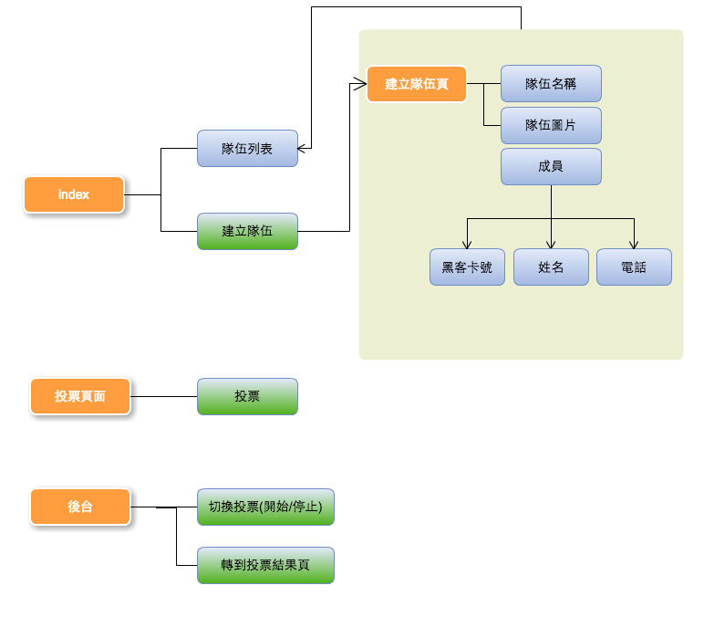

# HangeeHackthon-Vote

For Hackthon 6th final vote. 

## Flow



## pre-install

 * node.js@0.10.26
 * npm
 * [mongojs](https://github.com/mafintosh/mongojs)
 * [express@4.11.1rc](http://github.com/strongloop/express/)

## how to start

```
npm start
open http://localhost:8080
```

## api

Create a team :洗洗睡 (for test)
>data : ( no need )

```
[GET] api/create/test
```


Create a team (for test)
>data : 
>team {
> 
>		name : String,
> 
>		imgURL : String,
> 
>		projectName : String,
> 
>		projectDetail : String,
> 
>		github : String,
> 
>		members : [
> 
>				{ id : String, name : String, phone : String }, ...	
> 
>		],
> 
>}

```
[GET] api/create/test
```


##include

 * [jade](http://jade-lang.com/)
 * [bootstrap](http://getbootstrap.com/)
 * [jquery](http://jquery.com/)
 * [d3](https://github.com/mbostock/d3)
